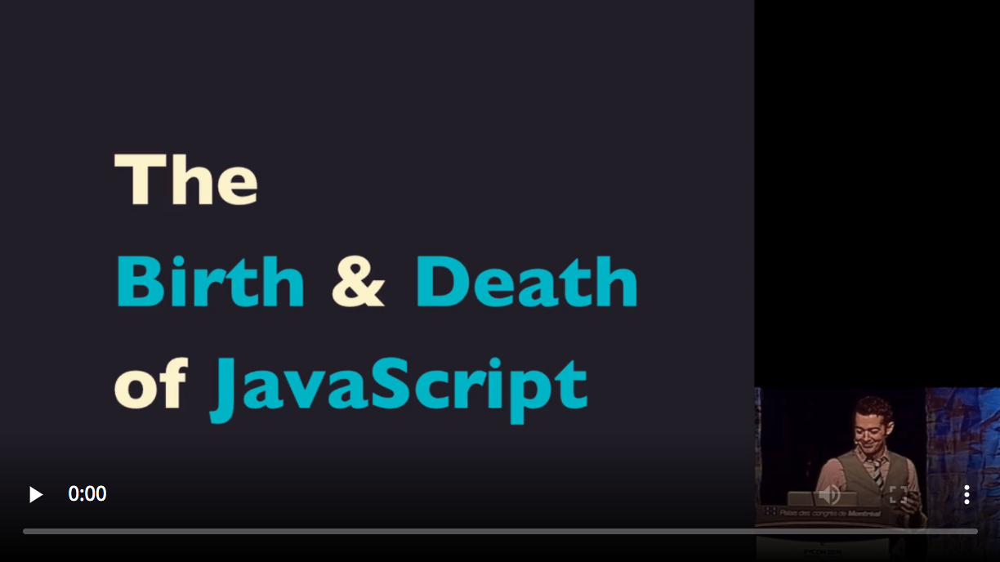

# Wasm? Wat?

## In its own words

- a binary instruction format for a stack-based virtual machine

- a portable compilation target for programming languages

## Other Wasm-capable Languages

[https://github.com/appcypher/awesome-wasm-langs](https://github.com/appcypher/awesome-wasm-langs)

- UI:

  - Blazor (C#)

- Generic:
  - NWSTK (C++)
  - Cheerp (C)
  - TinyGo
  - and many more

## My Favorite Video about Wasm

- [Birth and Death of Javascript](https://www.destroyallsoftware.com/talks/the-birth-and-death-of-javascript)

Made in 2014

Implementation details may have changed

Best explanation of where things could go

