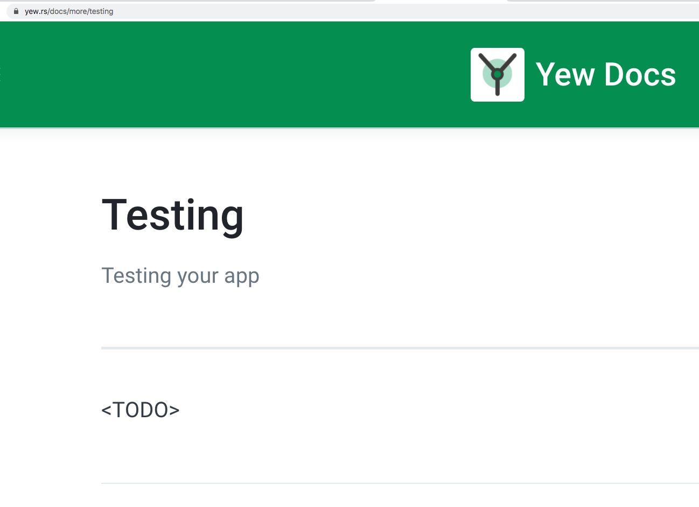

# Notes

## Docs need some work



## Direct CSS Support

[https://github.com/yewstack/yew/issues/533](https://github.com/yewstack/yew/issues/533)

- yew_css (inline declarations)

  - [https://github.com/hgzimmerman/yew_css](https://github.com/hgzimmerman/yew_css)

- css-in-rust (inspired by sass and styled components)

  - [https://github.com/lukidoescode/css-in-rust](https://github.com/lukidoescode/css-in-rust)

- css-modules
  - [https://crates.io/crates/css-modules](https://crates.io/crates/css-modules)

## Testing

wasm-bindgen-test

```rust
use wasm_bindgen_test::*;

#[wasm_bindgen_test]
fn pass() {
    assert_eq!(1, 1);
}
```

<div class="notes">
Runs in Node by default

Headless chrome as an option

must be in the root of the crate, or within a pub mod

</div>

## External Libs

- Needed (according to docs site)

  - Bootstrap/MaterialUi/arbitrary css framework component wrappers

- Yewtify seems promising

<div class="notes">
One I used was Yewtify, inspired by Vuetify. Needs more work though.
</div>
