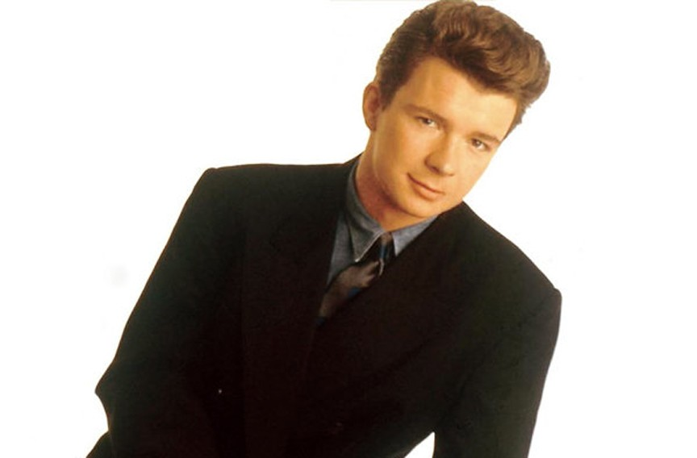

# Wrapping Up

## Other Rust Frameworks

[https://github.com/flosse/rust-web-framework-comparison#frontend-frameworks-wasm](https://github.com/flosse/rust-web-framework-comparison#frontend-frameworks-wasm)

Notables

- Seed
- Percy
- Draco
- Smithy

Seed seems to be popular but not much activity in comparison.

Instead of the html! macro they have custom macros that resemble Elm syntax

Seed is planning "react-like hooks"

## Other Rust Streamers (Game focused)

- rhymu8354 - game dev - backend
- mrhalzy - game dev - rust + godot
- madhousesteve - game dev - wasm/browser
- togglebit - game dev - rust + godot
- ectondev - game engine dev
- brookzerker - game dev (gg.ez)
- ferrisstreamsstuff - emulator and hardware dev
- urouroniwa - Dwarf Fortress clone

## Other Rust Streamers (misc)

- codeshow - en/pt - web backend
- provod - en/ru - digital art, demoscene
- museun - variety coding - no mic
- gamozo - low level (OS, fuzzing, etc)
- tsoding - variety coding
- jonhoo - infrequent for now
- steveklabnik - THE Steve Klabnik
- erikdotdev - backend focused
- rustaceans (Team) (managed by codeshow)

## Citations

- Yew documentation - [https://yew.rs](https://yew.rs)
- wasm-bindgen documentation - [https://rustwasm.github.io/docs/wasm-bindgen/](https://rustwasm.github.io/docs/wasm-bindgen/)

## Goodbye React/Angular/etc?

## Never gonna give Yew up

# Thank you

